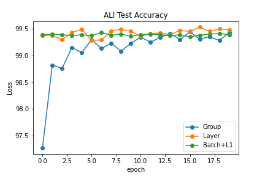
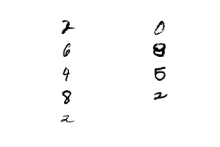
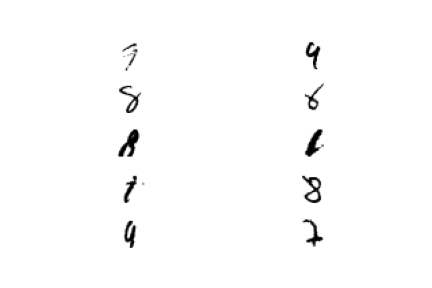
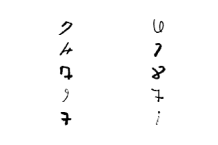

# EVA6_Session6

## Code Summary
The Code conatins 2 files, 1 Main and 1 Model file. 
### Model File
Model file contains the CNN model for Group, Batch and Layer Normalization and is imported in the main file. 

## Main File 
Main file contains the logic to run ALL 3 Normalization methods one by one using loops for 20 EPOC each. It also contains the logic to print misclassified images and print Graphs.
Value of parameter vNormalizationType controls the Normalization technique to be used
0 - Represents Group Normalization
1- Represents Layer Normalization
2- Represents Batch Normalization

## Normalizations
### Batch Normalization
It calculates 2 parameters (Mean and VAriance) for each image/channel in a given layer for ALL the images in a batch.
Mean : Average of ALL the pixel values in a channel across ALL channels in the same layer.
Standard Daviation = Subtract each pixelvalue from mean, square it and divide by total number.

## Layer Normalization
It calculates Mean and Variance for each image for 1 layer.

## Group Normalization
It divides the channels into groups and alculates Mean and Variance for Number of groups per image.

  
  
  
  
## Test Accuracy Across Group, Layer and Batch Normalization
 
 
## Train Accuracy Across Group, Layer and Batch Normalization

## Test Losses Across Group, Layer and Batch Normalization

## Train Losses Across Group, Layer and Batch Normalization

## Missclassified Images

### Group Normalization

### Layer Normalization

### Batch Normalization

