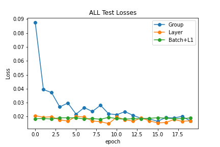

# EVA6_Session6

## Code Summary
The Code conatins 2 files, 1 Main and 1 Model file. 
### Model File
Model file contains the CNN model for Group, Batch and Layer Normalization and is imported in the main file. 

## Main File 
Main file contains the logic to run ALL 3 Normalization methods one by one using loops for 20 EPOC each. It also contains the logic to print misclassified images and print Graphs. 
Value of parameter <b>vNormalizationType</b> controls the Normalization technique to be used  
0 - Represents Group Normalization 
1- Represents Layer Normalization 
2- Represents Batch Normalization

## Normalizations
### Batch Normalization
It calculates 2 parameters (Mean and VAriance) for each image/channel in a given layer for ALL the images in a batch.
Mean : Average of ALL the pixel values in a channel across ALL channels in the same layer.
Standard Daviation = Subtract each pixelvalue from mean, square it and divide by total number.

## Layer Normalization
It calculates Mean and Variance for each image for 1 layer.

## Group Normalization
It divides the channels into groups and alculates Mean and Variance for Number of groups per image.

## Findings
### Layer Normalization without Trainable Parameters 
Layer Normalization performed the best with Best Accuracy of <b>99.50</b> 

### Batch Normalization with L1 
This Performed Second to best with socres <b>consistently above 99.4</b> 

### Group Normalization 
This performed well BUT NOT as good as compared to Layer and Batch with scores<b> consistently above 99.3</b>   

  
  
  
  
## Test Accuracy Across Group, Layer and Batch Normalization
 
 
## Train Accuracy Across Group, Layer and Batch Normalization

## Test Losses Across Group, Layer and Batch Normalization

## Train Losses Across Group, Layer and Batch Normalization

## Missclassified Images

### Group Normalization

### Layer Normalization

### Batch Normalization

